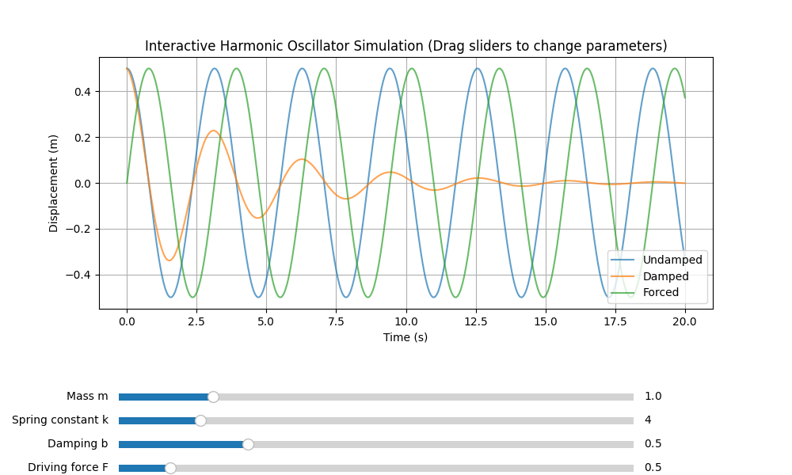
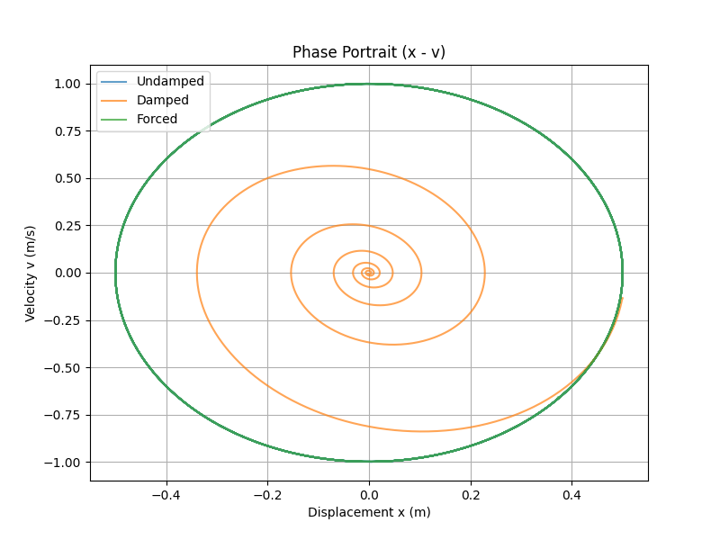

# 物理振子交互仿真器 | Interactive Harmonic Oscillator Simulator

**大一物理系力学仿真项目**  
**作者**：citybetunn212（ 
**完成时间**：2026年3月  
**GitHub**：https://github.com/citybetunn212/physics-simulator-first

### 项目介绍
用Python + Matplotlib实现**简谐振子三种情况**的实时交互仿真：
- 无阻尼振子
- 阻尼振子
- 受迫振动（稳态）

支持**4个参数实时拖动调节**（质量m、劲度系数k、阻尼系数b、驱动力F），可直观观察振子行为变化。

### 核心功能
- 实时动态曲线更新（3条曲线叠加对比）
- 交互滑块（Slider）调节参数
- 清晰的物理公式与参数说明
- 支持保存图片 / 导出数据（后续可扩展）

### 技术栈
- Python 3.14
- NumPy（数值计算）
- Matplotlib（绘图 + 交互Slider）

### 如何运行
```bash
pip install numpy matplotlib
python simple_harmonic_oscillator.py

### 项目效果预览


